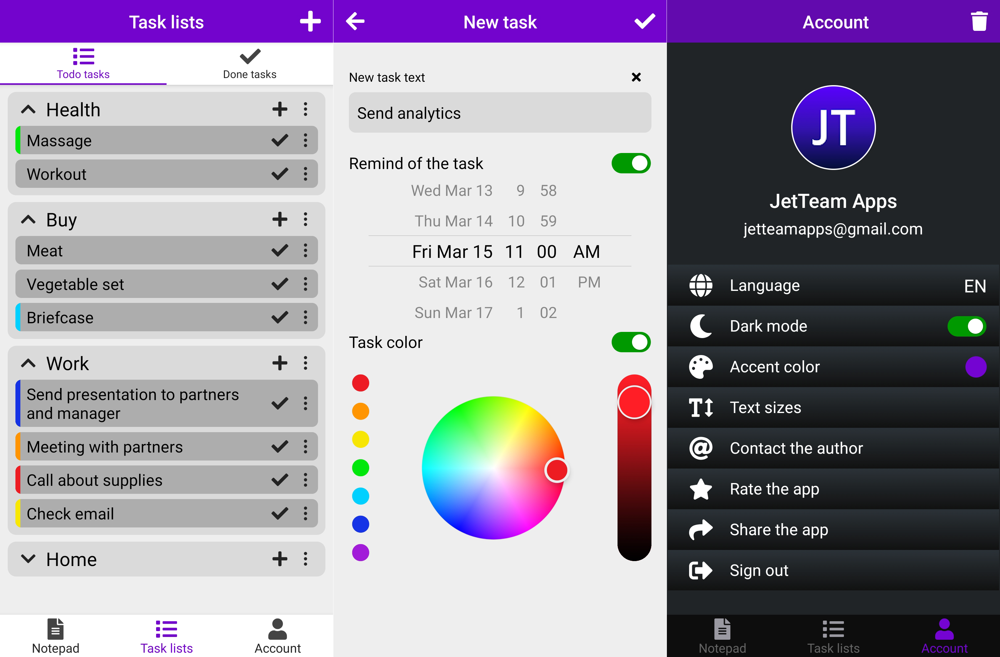

# ToDo List
Mobile task management application for Android and iOS.

Technologies: JavaScript, TypeScript, React Native, Redux, Redux-Saga, ESLint, Prettier, Firebase, i18next, Font Awesome.

Implemented: adding task or task list, removing task or task list, renaming task or task list, collapsing and uncollapsing task lists, marking the completed task, marking task with any color, screens for todo tasks and for done tasks, receiving tasks notification at a certain date and time, sign in with Google, user data storage and synchronizing with cloud database, internet connection checking, app accent color picker button, delete account button, change app language button, dark mode button, splash screen.

Before commit or push, please, run the script "husky_install" once. This command will enable git hooks "pre-commit" and "pre-push" for the repository. These hooks will make it possible to check commits.

If the git hooks still don't work, enter the following command in the IDE terminal. This command will grant access rights to Husky files. For Linux/MacOS/WSL: chmod ug+x .husky/*
